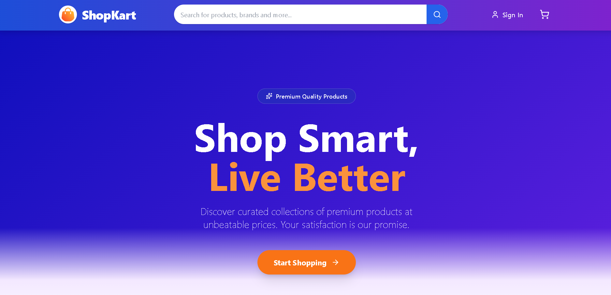
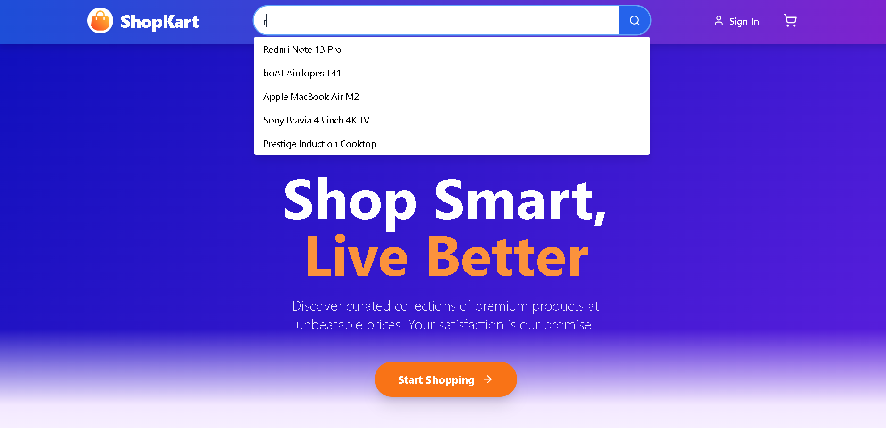
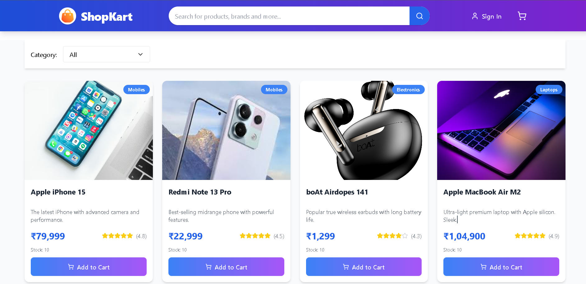
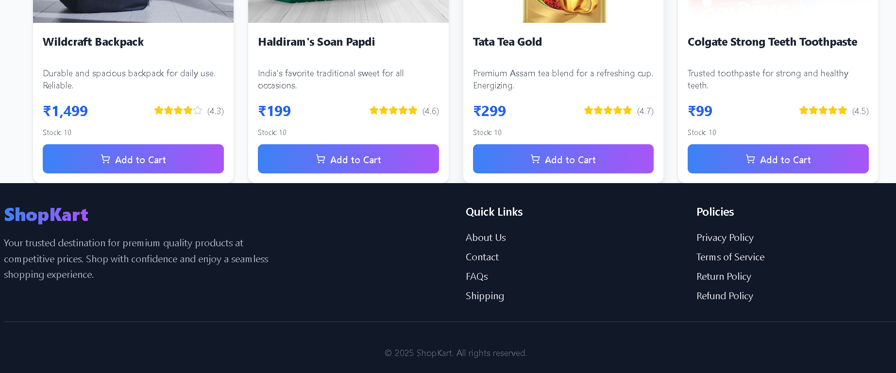

# MERN Stack Product Landing Page

A fully responsive e-commerce-style landing page built using the MERN stack, featuring live search, autosuggestions, and category filtering.

---

## Table of Contents
- [Overview](#overview)
- [Key Features](#key-features)
- [Tech Stack](#tech-stack)
- [Folder Structure](#folder-structure)
- [Setup Instructions](#setup-instructions)
- [API Endpoints](#api-endpoints)
- [Demo Video](#demo-video)
- [Project Images](#project-images)
- [Conclusion](#conclusion)

---

## Overview

This project is a Product Landing Page built using the MERN stack.  
It includes a modern frontend interface and a functional backend search API, similar to an e-commerce homepage like Amazon or Flipkart.

The application displays products fetched from MongoDB and allows users to search and filter them in real time.

The focus of the project is on:

- Clean and responsive UI  
- Fast product search with autosuggestions  
- Category-based filtering  
- Smooth user experience  
- Proper integration of React frontend with Node.js backend  

This assignment demonstrates full-stack development skills using React, Node.js, Express, and MongoDB, along with UI design, API integration, and state management.

---

## Key Features

###  Live Product Search
- Search bar with real-time suggestions
- Displays matching products as the user types
- Powered by MongoDB regex queries

###  Category Filtering
- Dropdown filter for product categories
- Instantly updates product grid

###  Product Grid
- Shows product image, price, rating, description
- Fully responsive layout
- Works on desktop, tablet, and mobile

###  Responsive Design
- 4 products per row on desktop
- 2 products per row on tablet
- 1 product per row on mobile

###  Backend API
- Node.js + Express server
- `/api/products` → Fetch all products
- `/api/search?q=` → Search products
- MongoDB database for storing product data

###  Tech Stack

**Frontend:**
- React
- Tailwind CSS
- Lucide Icons

**Backend:**
- Node.js
- Express.js

**Database:**
- MongoDB & Mongoose


## Folder Structure
```
/Assignment/Trizen
  ├── backend/    # Node.js, Express, MongoDB API
  └── frontend/   # React app (UI)
```

## Setup Instructions

### Prerequisites
- Node.js & npm
- MongoDB Atlas account (or local MongoDB)

### 1. Backend Setup
```sh
cd backend
npm install
# Configure your MongoDB URI in a .env file:
# MONGODB_URI=your_mongodb_connection_string
npm start      # Start backend server (default: http://localhost:5000)
```

### 2. Frontend Setup
```sh
cd frontend
npm install
npm run dev    # Start React app (default: http://localhost:5173)
```

## API Endpoints
- `GET /products` – Returns all products
- `GET /search?q=term` – Returns up to 5 products matching the search term (case-insensitive, partial match)

# Demo Video

Watch the project demo here: [Google Drive Video](https://drive.google.com/file/d/1Nq4oBvZtuClrTr75vLwldcfy06O-7Wuh/view?usp=sharing)

# Project Images

Below are the images present in the `public` folder, shown in the same order (1, 2, 3, 4):

<div align="center">
  
  
</div>
<div align="center">
  
  
</div>

## Conclusion
This MERN project includes a responsive product landing page with backend-powered search, category filtering, and a clean UI.  
Thank you for reviewing my submission.

